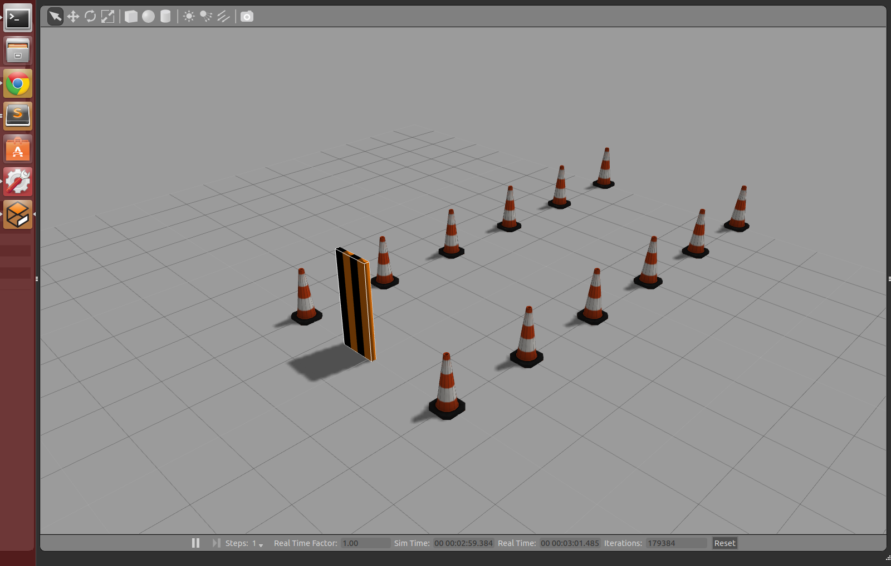
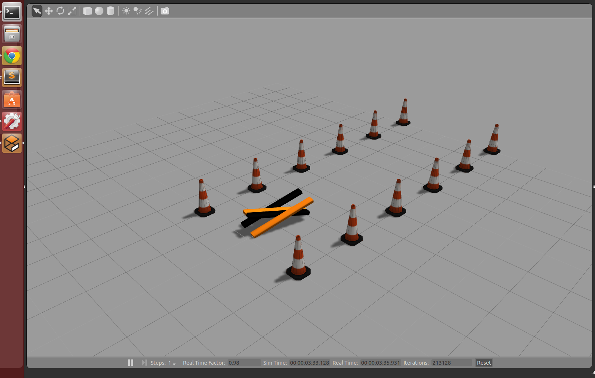
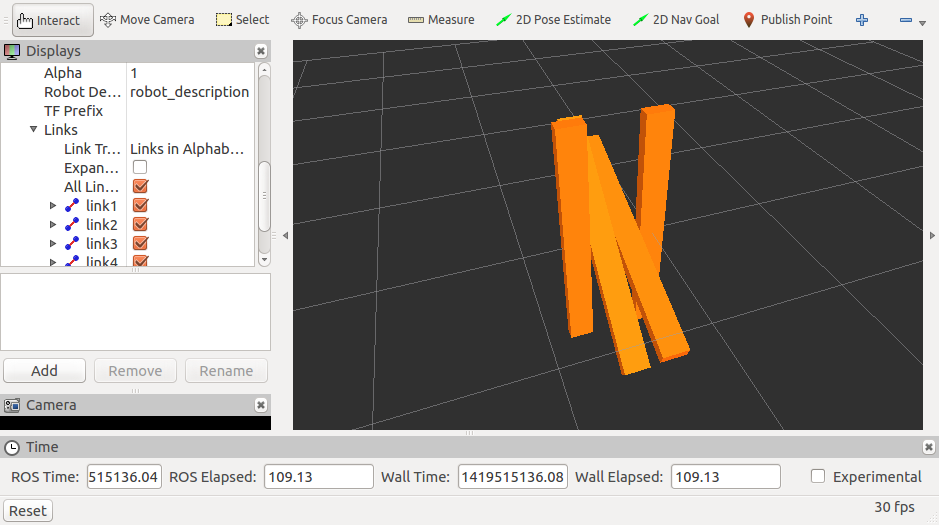

Main

# TARS Robot

This is an experimental project to simulate and teach a robot control dynamics. The robot of choice is a simple model of the [TARS](docs/TARS.md) robot seen in Interstellar.

## Goal

The goal of this project is to teach the TARS robot to move forward in the simulated environment without moving any cones.

An example python control program can be found in the tars_sample_controller package. It demonstrates the ability to control the TARS robot while it is in a physical simulation:

The TARS robot is currently very simplified. It has 3 joints and 4 legs all acuated around the center.

## Project Overview

Currently the project makes use of [ROS](http://www.ros.org/) and [Gazebo](http://gazebosim.org/) for controlling and simulating the robot respectively.

### Components
+ **tars_core** - Core packages used for robot description and client interfaces for the simulator.
	+ [**tars_corecpp**](tars_core/tars_corecpp/README.md) - C++ shared library that abstracts control of the TARS simulated robot. 
	+ [**tars_corepy**](tars_core/tars_corepy/README.md) - Python package that abstracts control of the TARS simulated robot 
	+ **tars_world** - Describes the TARS robot model and world, simulation settings and launching simulation world.
+ **tars_controller_samples**
	+ [**tars_sample_controller_cpp**](tars_controller_samples/tars_sample_controller_cpp/README.md) - C++ shared library that abstracts control of the TARS simulated robot 
	+ [**tars_sample_controller_py**](tars_controller_samples/tars_sample_controller_py/README.md) - Python shared package that abstracts control of the TARS simulated robot 
+ **tars_sim** - Example simulation runner. Runs TARS robots for period and restarts periodically.
+ **tars_controller_nn** - Example custom controller.

### Roadmap

+ Create framework for spawning, running, and resetting robots
+ Make single random NN for robot control
+ Implement NEAT evolutionary algorithm for training
+ Implement database to store NEAT results

## Setup

**This is currently only tested and running on Ubuntu 14.04**

### Installation
Dependencies:
+ [Install ROS](http://wiki.ros.org/indigo/Installation/Ubuntu)
+ [Install ROS Controller](http://wiki.ros.org/ros_control) - See bottom of wiki page
+ Install Ros Gazebo Ros Control - `sudo apt-get install ros-indigo-gazebo-ros-control`
+ [Make a ROS Workspace](http://wiki.ros.org/catkin/Tutorials/create_a_workspace)
+ Check this directory out into your catkin workspace `src/` folder
+ Go back to your catkin workspace folder
+ Make your catkin workspace: `catkin_make; catkin_make install`
+ Source the environment setup: `source devel/setup.sh`
+ Install pygame for python graphics: `sudo apt-get install python-pygame`

This project will compile packages as normal under ROS catkin make.

### To Run

To open Gazebo to visualize the simulation run:

	roslaunch tars_world tars_world.launch

To start running simulations run:

	rosrun tars_sim tars_sim

## Reference Material

Some articles and material that has been helpful:

#### ROS
+ [Tutorial: Using a URDF in Gazebo](http://gazebosim.org/tutorials?tut=ros_urdf)
+ [Tutorial: ROS Control](http://gazebosim.org/tutorials?tut=ros_control)
+ [Package: gazebo](http://wiki.ros.org/gazebo)
+ [Building Modular ROS Packages](http://jbohren.com/articles/modular-ros-packages/)

#### ML
+ [Competitive Coevolution through Evolutionary Complexification](https://www.jair.org/media/1338/live-1338-2278-jair.pdf) - Details on NEAT algorithm
+ [A Comparative Analysis of Simplification and Complexification in the Evolution of Neural Network Topologies](http://anji.sourceforge.net/docs/james_gecco04.pdf) - Analysis of simplification in a NEAT algorithm

#### ML Applications
+ [Flexible Muscle-Based Locomotion for Bipedal Creatures](http://www.cs.ubc.ca/~van/papers/2013-TOG-MuscleBasedBipeds/2013-TOG-MuscleBasedBipeds.pdf) - Interesting take on training gait ([video](http://vimeo.com/79098420))

## Thanks!

Thanks for looking and please feel free to contact if you would like to help in any way. From 3D modelling to programming to AI to robot building - all is welcomed.
