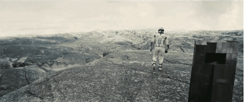
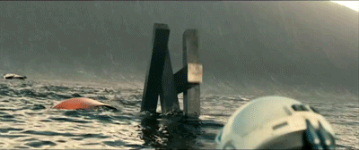

[Main](../README.md) > inspiration

# TARS Robot

While the robot itself is much more sophisticated, our model is very simplified.

Some inspiration!

## Current Model

The current model for our simulation has 3 joints and 4 legs. The joins are all at the midpoint for now.

